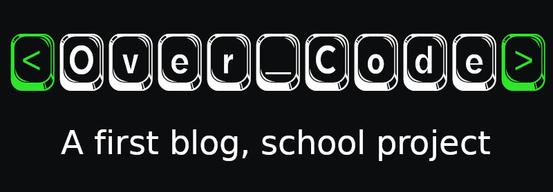

[](https://www.codacy.com/gh/phil-all/Portfolio-OCR-Projet5/dashboard?utm_source=github.com&amp;utm_medium=referral&amp;utm_content=phil-all/Portfolio-OCR-Projet5&amp;utm_campaign=Badge_Grade)

## Table of Contents
- [General info](#general-info)
- [Technologies](#technologies)
- [Getting started](#getting-started)
- [Features](#features)
- [Author](#author)
- [Contributing](#contributing)

## General info

Over_Code blog is the fifth study project of: web application developper PHP & Symfony, by Openclassrooms.

## Technologies
This project is created with:
- Apache2 HTTP server
- Mariadb 8.0 database
- PHP 8
- Bootstrap 5
- Twig 3
- Swiftmailer 6
- Mailtrap.io (for testing in catching sent emails)
- Json Web Tokens

## Getting started

To install needed dependencies, launch `Composer`

```bash
composer init
```

Install `Twig` for templating html

```bash
composer require "twig/twig:^3.0"
```

Install `Dotenv` component to parse .env files, and make environment variables stored in them accessible via $_ENV.

```bash
composer require "symfony/dotenv:^5.3"
```

Install `Swiftmailer` to send emails

```bash
composer require "swiftmailer/swiftmailer:^6.0"
```

Rename `.env.dist` file in `.env` and set values "changethis" by your own as example follow

```bash
#DATABASE
DSN=changethis
DB_USERNAME=changethis
DB_PASSWORD=changethis
```

## Features

- `Dynamic routing`, which don't use a routes file, but deduce classes ,methods and arguments in analizing URL parameters

## Author

**Philippe Allard-Latour** - *Main* - [Github](https://github.com/phil-all)
*Other repositeries* - [Github](https://github.com/phil-all?tab=repositories)

## Contributing

This is a study project, thanks to **NOT** contributing.