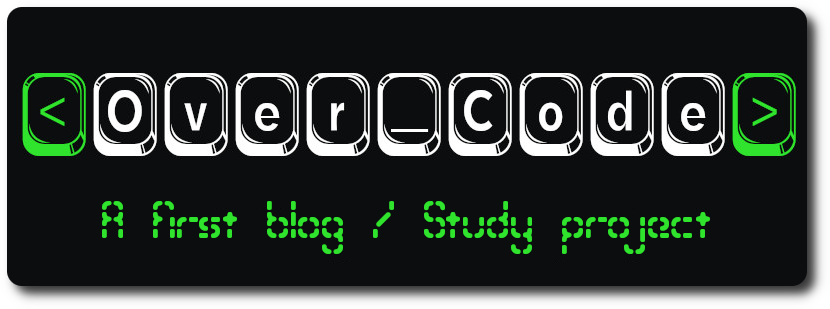
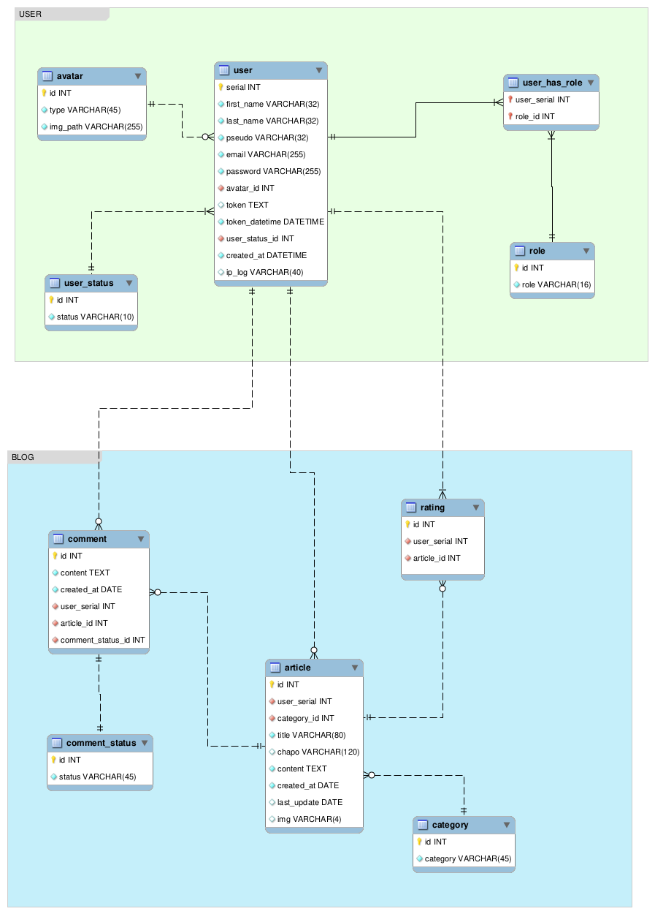
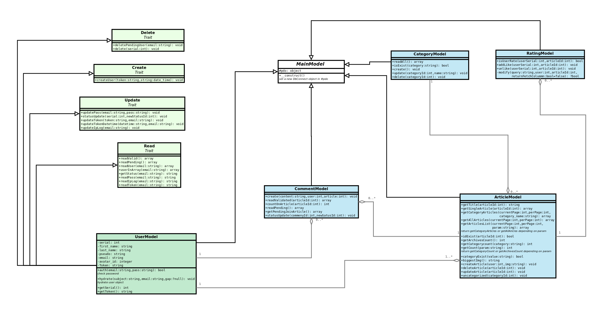
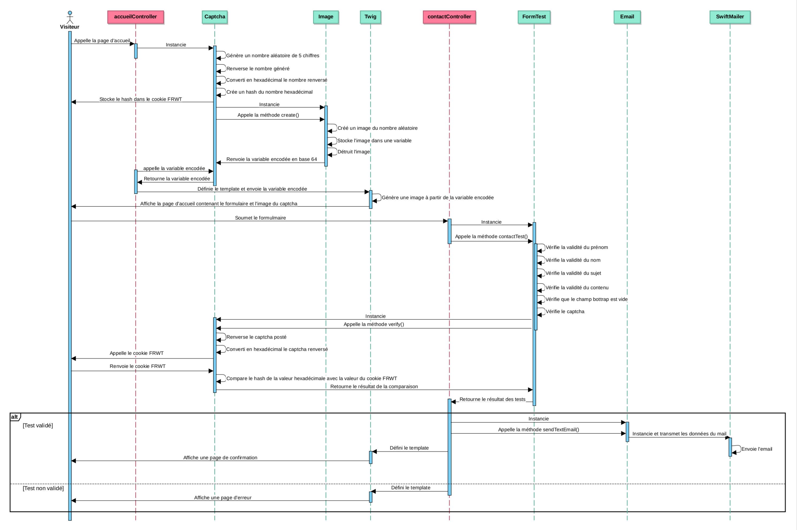

[](https://www.codacy.com/gh/phil-all/Portfolio-OCR-Projet5/dashboard?utm_source=github.com&amp;utm_medium=referral&amp;utm_content=phil-all/Portfolio-OCR-Projet5&amp;utm_campaign=Badge_Grade) [](https://frontend.code-inspector.com/project/29630/dashboard)

## Table of Contents

-   [General info](#general-info)

-   [Project status](#project-status)

-   [Technologies](#technologies)

-   [Third parties](#third-parties)

-   [Getting started](#getting-started)

-   [Model class diagram](#model-class-diagram)

-   [Database](#database)

-   [Features](#features)

-   [Author](#author)

-   [Contributing](#contributing)

## General info

Over_Code blog is the fifth study project of: web application developper PHP & Symfony, by Openclassrooms.

## Wiki

Consult project [wiki](https://github.com/phil-all/Portfolio-OCR-Projet5/wiki)

## Project Status

> Project is: `in progress`

## Technologies

This project is created with:

-   Apache2 HTTP server
-   Mariadb 8.0 database
-   PHP 8

## Third parties

-   Bootstrap 5
-   Twig 3
-   Swiftmailer 6
-   Mailtrap (for testing in catching sent emails)
-   Dompdf

## Getting started

### Composer

> The `composer.json` file is needed by composer.

If composer not yet installed on your system, follow the wiki: [Composer install and initialization](https://github.com/phil-all/Portfolio-OCR-Projet5/wiki/Composer-install-and-use).

### .env file needed

Rename `.env.dist` file in `.env` and set values "changethis" by your own as example follow

```bash
DSN=changethis
DB_USERNAME=changethis
DB_PASSWORD=changethis
```

could became :

```bash
DSN=mysql:host=name_of_your_host;dbname=name_of_your_db
DB_USERNAME=JOHNDOE
DB_PASSWORD=a_cray_pass
```

## Database

Use a Mariadb 8.0 or Mysql 8.0 server.

### 1. Database install

Please consult the [database wiki](https://github.com/phil-all/Portfolio-OCR-Projet5/wiki/Database-install) to create schema and make a demo seeding.

### 2. Database Entity Relationship Diagram



## Model class diagram



## Features

-   `Dynamic routing`, which don't use a routes file, but deduce classes ,methods and arguments in analizing URL parameters

-   Home made token authentification user, `JWT` type

-   Curriculum pdf is `generated by PHP`. There's no pdf file.

-   Home made [captcha](https://github.com/phil-all/Portfolio-OCR-Projet5/wiki/Home-made-captcha)


## Author

**Philippe Allard-Latour**

-   [Twitter](https://twitter.com/AllardLatour)
-   [Github](https://github.com/phil-all)

## Contributing

This is a study project, thanks to **`NOT`** contributing.
